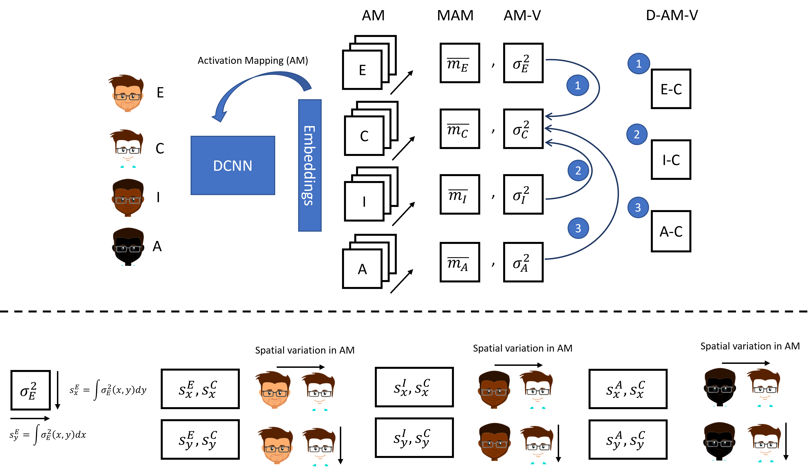
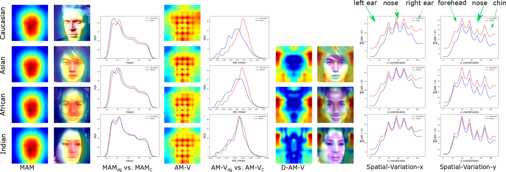

# Demographic_Bias_Visualization

##The implementatioon of "Towards Explaining Demographic Bias through the Eyes of Face Recognition Models", IJCB 2022.

The pipeline describes the framework of our proposed explainability tools.


Visualization outputs:


## Configuration Environment
- Python 3.6
- Pytorch
- torchvision

## Dataset
RFW, BFW
The activation mappings are stored in the data, which can be downloaded from  <a href="https://cloud-ext.igd.fraunhofer.de/s/LqwWTLf8Wz7TqAw">here</a>.
Please download the data and unzip it in the same folder in the following structure. 

```
data 
└───r50
   └───RFW
       │   file111.npy
   └───BFW
       │   file111.npy
   └───gender
       │   file111.npy
└───r100
    └───RFW
       │   file111.npy
   └───BFW
       │   file111.npy
   └───gender
       │   file111.npy
```
## Run
To get the visualization for ethnicity please run:
```bash
$ python main.py
```
To get the visualization for gender please run:
```bash
$ python ActivationMapping_Gender.py
```

To get the fairness metric, please run:
```bash
$ python global_threshold.py
```
## Citation
Please cite our paper if the code is helpful to your research.
